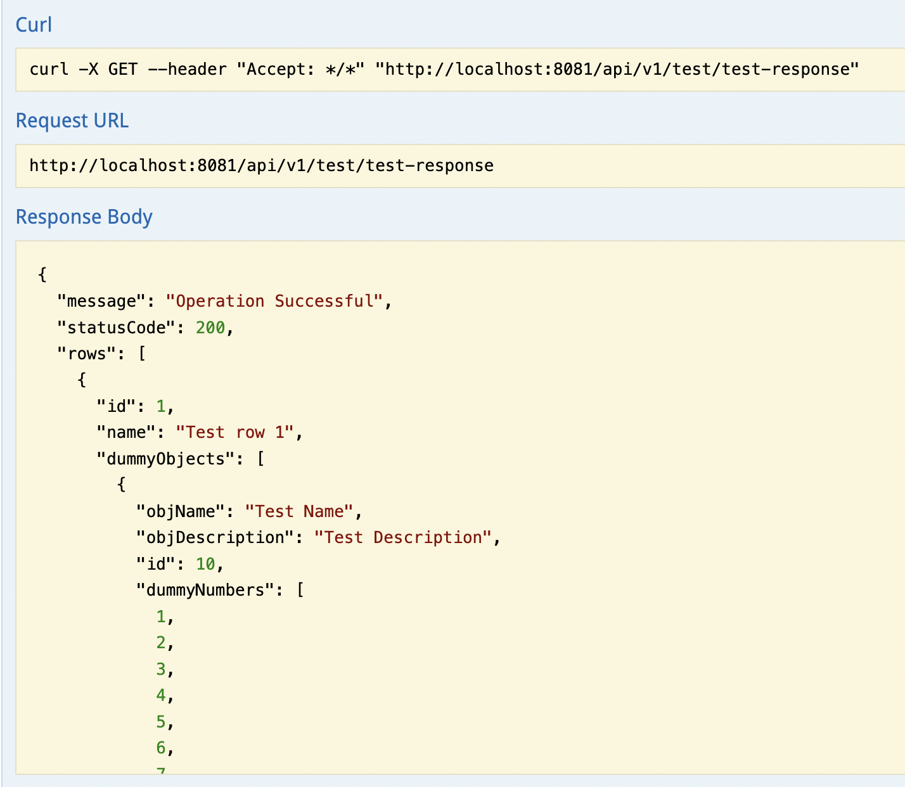

 

# Swagger Response Prettier
Prettify json response we are getting in swagger with this chrome extension.

Swagger-ui version tested: `2.2.2`

Before using this extension:

After using this extension:

To install this extension please follow these steps:
- Download this repository
- Go to chrome Browser and go to `Extensions` -> `Manage Extensions`
- Click on `Load Unpacked` and select the downloaded repository folder
- Before that, make sure you turned on the `Developer Mode`
- Enable `Swagger UI Prettify` extension
